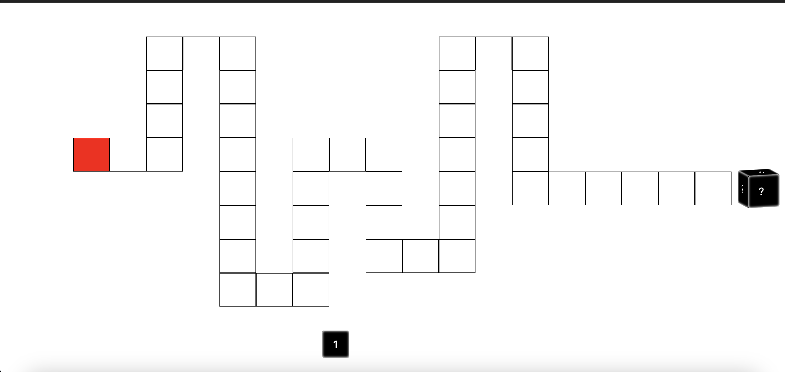
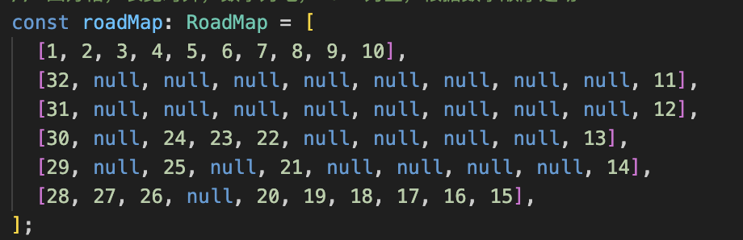

# Vue + Ts 编写的大富翁，支持自定义路径，动画和图片可以自行添加

## dev

```bash
git clone https://github.com/YaminZheng/zillionaire.git
cd zillionaire
yarn set version stable
yarn install
yarn dev
```

## 设置路径

- 打开 /src/App.vue
- 修改 roadMap 常量
- 四方格，长宽对齐，数字为地，null 为空，根据数字顺序走动

## 展示




## 提示

**默认是大富翁样式**
**老虎机可以按照下边参数调整**

```typescript
// App.vue
IS_CAN_LOOP = true;
JUMP_INTERVAL = 30;
SIFTER_MIN = 60;
SIFTER_MAX = 60;
ROAD_MAP = [
  [1, 2, 3],
  [8, null, 4],
  [7, 6, 5],
];
```
